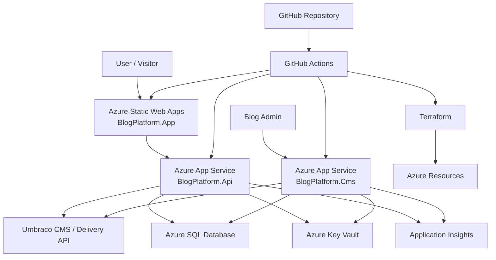

# Azure Deployment Roadmap

## Legend

- ✅ **DONE**
- 🟡 **PARTIALLY DONE**
- ⬜ **NOT DONE**

---

## Current Status

BlogPlatform is a working local .NET portfolio platform. Azure infrastructure is now created through Terraform, and the next step is deploying the real application packages to Azure.

### ✅ Already Done

- ✅ Blazor WebAssembly frontend exists: `BlogPlatform.App`
- ✅ ASP.NET Core API exists: `BlogPlatform.Api`
- ✅ Umbraco CMS exists: `BlogPlatform.Cms`
- ✅ Clean/layered solution structure exists
- ✅ Local SQL Server / LocalDB configuration exists
- ✅ API reads content from CMS / Umbraco Delivery-style endpoints
- ✅ Serilog file logging exists
- ✅ Swagger exists for API
- ✅ `infra/` folder exists
- ✅ `AZURE.md` exists
- ✅ Production config placeholder exists for API
- ✅ Production config placeholder exists for CMS
- ✅ Production config placeholder exists for Blazor App
- ✅ API health endpoints exist
- ✅ CMS health endpoints exist
- ✅ SQL readiness health check exists
- ✅ CMS dependency health check exists for API
- ✅ Application Insights SDK wiring exists for API
- ✅ Application Insights SDK wiring exists for CMS
- ✅ Azure Key Vault configuration provider exists for API
- ✅ Azure Key Vault configuration provider exists for CMS
- ✅ Key Vault URI placeholders exist in production config
- ✅ Initial Terraform baseline exists in `infra/`
- ✅ GitHub Actions Azure readiness workflow exists
- ✅ GitHub Actions Terraform validate step passes
- ✅ GitHub Actions Terraform plan workflow exists
- ✅ Terraform remote state backend is configured
- ✅ Terraform plan can run from GitHub Actions
- ✅ Terraform apply workflow exists
- ✅ Terraform apply succeeded from GitHub Actions
- ✅ Real Azure resources were created by Terraform
- ✅ Real Azure Application Insights resource exists
- ✅ Real Azure Key Vault resource exists
- ✅ Real Key Vault secrets are created by Terraform
- ✅ Managed Identity is created for API and CMS App Services
- ✅ Azure App Settings are defined by Terraform
- ✅ Azure SQL connection string is stored in Key Vault

### 🟡 Partially Done

- 🟡 GitHub Actions CI exists, but application deployment is not complete yet
- 🟡 Application Insights exists, but telemetry still needs to be validated after deployment
- 🟡 Key Vault exists, but runtime access still needs to be validated after deployment
- 🟡 Managed Identity exists, but runtime secret resolution still needs to be validated after deployment
- 🟡 Health checks are implemented, but still need to be tested against the deployed Azure apps

### ⬜ Not Done Yet

- ⬜ API deployed to Azure App Service
- ⬜ CMS deployed to Azure App Service
- ⬜ Blazor App deployed to Azure Static Web Apps
- ⬜ Public Azure deployment tested
- ⬜ API health endpoint tested in Azure
- ⬜ CMS health endpoint tested in Azure
- ⬜ Blazor App tested against deployed API
- ⬜ Application Insights telemetry validated
- ⬜ Key Vault secret resolution validated
- ⬜ README Azure portfolio story update

---

## Goal

Deploy BlogPlatform to Azure as a real cloud portfolio project showing:

- .NET backend deployment
- Blazor WebAssembly hosting
- Umbraco CMS hosting
- Azure SQL Database
- Terraform Infrastructure as Code
- GitHub Actions CI/CD
- Azure Key Vault
- Application Insights
- Health checks
- Managed Identity
- production-ready configuration

---

## Target Azure Architecture



---

## Next Implementation Step

Add a manual GitHub Actions deployment workflow:

```text
.github/workflows/azure-deploy.yml
```

This workflow should:

1. Build the solution.
2. Run tests.
3. Publish API.
4. Publish CMS.
5. Publish Blazor WebAssembly app.
6. Deploy API to Azure App Service.
7. Deploy CMS to Azure App Service.
8. Get the Static Web Apps deployment token from Azure.
9. Deploy Blazor App to Azure Static Web Apps.
10. Check API and CMS `/health/live` endpoints.

This is the next reasonable step because Terraform infrastructure is already created and the repository now needs real application deployment.
