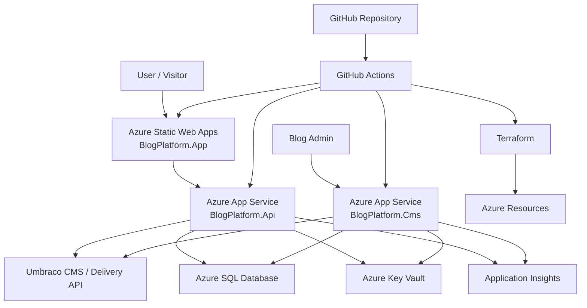
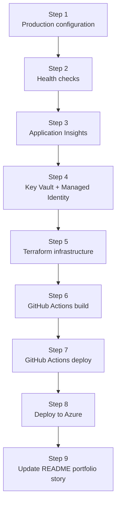
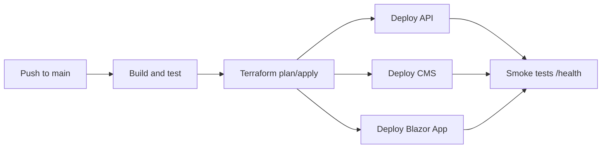

# Azure Deployment Roadmap

## Current Status

BlogPlatform is already a working local .NET portfolio platform, but it is not yet Azure-deployment ready.

Already done:

* [x] Blazor WebAssembly frontend exists: `BlogPlatform.App`
* [x] ASP.NET Core API exists: `BlogPlatform.Api`
* [x] Umbraco CMS exists: `BlogPlatform.Cms`
* [x] Clean/layered solution structure exists
* [x] Local SQL Server / LocalDB configuration exists
* [x] API reads content from CMS / Umbraco Delivery-style endpoints
* [x] Serilog file logging exists
* [x] Swagger exists for API
* [x] `infra/` folder exists
* [x] `AZURE.md` exists

Not done yet:

* [ ] Production Azure configuration
* [ ] `appsettings.Production.json`
* [ ] Health check endpoints
* [ ] Application Insights
* [ ] Azure Key Vault integration
* [ ] Managed Identity
* [ ] Terraform infrastructure
* [ ] GitHub Actions build pipeline
* [ ] GitHub Actions deployment pipeline
* [ ] Azure deployment
* [ ] README Azure portfolio story update

---

## Goal

Deploy BlogPlatform to Azure as a real cloud portfolio project showing:

* .NET backend deployment
* Blazor WebAssembly hosting
* Umbraco CMS hosting
* Azure SQL Database
* Terraform Infrastructure as Code
* GitHub Actions CI/CD
* Azure Key Vault
* Application Insights
* Health checks
* Managed Identity
* production-ready configuration

---

## Target Azure Architecture



---

## Roadmap Order



---

# Step 1 — Production Configuration

Goal: remove local-only assumptions.

Current repo status:

* [x] `BlogPlatform.App` already reads `Api:BaseUrl`
* [x] `BlogPlatform.Api` already reads `UmbracoDeliveryApi:BaseUrl`
* [x] `BlogPlatform.Api` already has CORS configuration
* [x] `BlogPlatform.Cms` already has safe placeholder for Umbraco HMAC secret
* [x] Development connection strings are separated into `appsettings.Development.json`
* [ ] `BlogPlatform.Api/appsettings.Production.json` does not exist
* [ ] `BlogPlatform.Cms/appsettings.Production.json` does not exist
* [ ] `BlogPlatform.App/wwwroot/appsettings.Production.json` does not exist
* [ ] Azure App Settings are not documented yet
* [ ] Production CORS values are not configured yet

Tasks:

* [ ] Add production config for `BlogPlatform.Api`
* [ ] Add production config for `BlogPlatform.Cms`
* [ ] Add production config for `BlogPlatform.App`
* [ ] Configure production API URL for Blazor
* [ ] Configure production CMS URL for API
* [ ] Configure production CORS allowed origins
* [ ] Keep secrets out of source control
* [ ] Use Azure App Settings for environment-specific values

Expected result:

The app can run locally and in Azure using different configuration values.

---

# Step 2 — Health Checks

Goal: make API and CMS cloud-monitorable.

Current repo status:

* [ ] API health checks are not implemented
* [ ] CMS health checks are not implemented
* [ ] `/health` endpoint is not implemented
* [ ] `/health/live` endpoint is not implemented
* [ ] `/health/ready` endpoint is not implemented
* [ ] SQL readiness check is not implemented
* [ ] CMS readiness check is not implemented

Tasks:

* [ ] Add health check package if needed
* [ ] Add health checks to `BlogPlatform.Api`
* [ ] Add health checks to `BlogPlatform.Cms`
* [ ] Add `/health`
* [ ] Add `/health/live`
* [ ] Add `/health/ready`
* [ ] Add SQL readiness check
* [ ] Add CMS dependency readiness check
* [ ] Use health checks later in GitHub Actions smoke tests

Expected endpoints:

```text
/health
/health/live
/health/ready
```

Expected result:

Azure and CI/CD can verify whether API and CMS are alive and ready.

---

# Step 3 — Application Insights

Goal: show production observability.

Current repo status:

* [x] Serilog logging exists
* [x] Shared local file logging exists
* [x] API request logging exists through Serilog
* [x] CMS request logging exists through Serilog
* [ ] Application Insights package is not installed
* [ ] Application Insights is not configured in API
* [ ] Application Insights is not configured in CMS
* [ ] Connection string is not configured
* [ ] Telemetry is not connected to Azure

Tasks:

* [ ] Add Application Insights to `BlogPlatform.Api`
* [ ] Add Application Insights to `BlogPlatform.Cms`
* [ ] Configure `APPLICATIONINSIGHTS_CONNECTION_STRING`
* [ ] Track requests
* [ ] Track exceptions
* [ ] Track dependency calls
* [ ] Track failed API calls
* [ ] Track startup errors
* [ ] Keep existing Serilog logging for local diagnostics

Expected result:

The project looks operated, not only coded.

---

# Step 4 — Azure Key Vault and Managed Identity

Goal: secure production secrets.

Current repo status:

* [x] CMS HMAC secret uses placeholder in normal `appsettings.json`
* [x] Development secrets are separated from normal config
* [ ] Key Vault package is not installed
* [ ] `Azure.Identity` is not configured
* [ ] Managed Identity is not configured
* [ ] API does not read secrets from Key Vault
* [ ] CMS does not read secrets from Key Vault
* [ ] Terraform does not create Key Vault yet

Secrets to move to Key Vault:

* [ ] SQL connection string
* [ ] Umbraco HMAC secret
* [ ] future API keys
* [ ] future CMS/admin secrets

Tasks:

* [ ] Add Key Vault integration to API
* [ ] Add Key Vault integration to CMS
* [ ] Use `DefaultAzureCredential`
* [ ] Enable Managed Identity on API App Service
* [ ] Enable Managed Identity on CMS App Service
* [ ] Grant Key Vault access to both identities
* [ ] Store production secrets in Key Vault
* [ ] Reference secrets from app configuration

Expected result:

No production secrets are stored in GitHub.

---

# Step 5 — Terraform Infrastructure

Goal: make Azure environment reproducible.

Current repo status:

* [x] `infra/` folder exists
* [x] `infra/README.md` exists
* [ ] Terraform files do not exist yet
* [ ] Resource Group is not defined
* [ ] App Service Plan is not defined
* [ ] API App Service is not defined
* [ ] CMS App Service is not defined
* [ ] Static Web App is not defined
* [ ] Azure SQL Server is not defined
* [ ] Azure SQL Database is not defined
* [ ] Key Vault is not defined
* [ ] Application Insights is not defined
* [ ] Managed identities are not defined
* [ ] App settings are not defined

Suggested structure:

```text
infra/
  main.tf
  variables.tf
  outputs.tf
  resource-group.tf
  app-service-plan.tf
  app-service-api.tf
  app-service-cms.tf
  static-web-app.tf
  sql.tf
  key-vault.tf
  application-insights.tf
```

Terraform should create:

* [ ] Resource Group
* [ ] App Service Plan
* [ ] API App Service
* [ ] CMS App Service
* [ ] Static Web App
* [ ] Azure SQL Server
* [ ] Azure SQL Database
* [ ] Key Vault
* [ ] Application Insights
* [ ] Managed identities
* [ ] App settings
* [ ] Key Vault access policies or RBAC assignments

Expected result:

Azure environment can be recreated from code.

---

# Step 6 — GitHub Actions Build Pipeline

Goal: prove the repo builds automatically.

Current repo status:

* [x] Solution file exists: `BlogPlatform.slnx`
* [x] Architecture test project exists
* [ ] `.github/workflows` folder does not exist
* [ ] Build pipeline does not exist
* [ ] Test pipeline does not exist
* [ ] Publish artifacts step does not exist

Pipeline should:

* [ ] Restore NuGet packages
* [ ] Build solution
* [ ] Run architecture tests
* [ ] Publish API artifact
* [ ] Publish CMS artifact
* [ ] Publish Blazor App artifact

Expected result:

Every push proves the solution still builds.

---

# Step 7 — GitHub Actions Deployment Pipeline

Goal: deploy automatically to Azure.

Current repo status:

* [ ] Deployment pipeline does not exist
* [ ] Azure login is not configured
* [ ] Terraform plan/apply is not configured
* [ ] API deployment is not configured
* [ ] CMS deployment is not configured
* [ ] Blazor deployment is not configured
* [ ] Smoke tests are not configured

Deployment flow:



Tasks:

* [ ] Add Azure federated credentials or service principal
* [ ] Add GitHub repository secrets
* [ ] Add Terraform workflow
* [ ] Add API deployment
* [ ] Add CMS deployment
* [ ] Add Static Web App deployment
* [ ] Add post-deployment health checks
* [ ] Add deployment summary output

Expected result:

Push to main can build, provision, deploy, and smoke-test the system.

---

# Step 8 — Azure Deployment

Recommended Azure services:

| Component          | Azure Service         |
| ------------------ | --------------------- |
| `BlogPlatform.App` | Azure Static Web Apps |
| `BlogPlatform.Api` | Azure App Service     |
| `BlogPlatform.Cms` | Azure App Service     |
| Database           | Azure SQL Database    |
| Secrets            | Azure Key Vault       |
| Monitoring         | Application Insights  |
| CI/CD              | GitHub Actions        |
| Infrastructure     | Terraform             |

Current deployment status:

* [ ] Azure Resource Group created
* [ ] Azure SQL created
* [ ] API deployed
* [ ] CMS deployed
* [ ] Blazor App deployed
* [ ] Key Vault configured
* [ ] Application Insights receiving telemetry
* [ ] Health checks passing
* [ ] Public URLs documented

Expected result:

BlogPlatform runs publicly on Azure.

---

# Step 9 — README Portfolio Story

Goal: make the project useful for career positioning.

Current repo status:

* [x] README already describes the project as a cloud-oriented portfolio platform
* [x] README already mentions future Azure deployment
* [ ] README does not yet describe a completed Azure deployment
* [ ] README does not yet show final Azure architecture
* [ ] README does not yet show CI/CD pipeline
* [ ] README does not yet show Terraform infrastructure
* [ ] README does not yet show production monitoring

Tasks:

* [ ] Add Azure architecture diagram to README
* [ ] Add deployment section
* [ ] Add CI/CD section
* [ ] Add Terraform section
* [ ] Add monitoring section
* [ ] Add health checks section
* [ ] Add production URLs when deployed

Final portfolio message:

> BlogPlatform is a Clean Architecture .NET cloud project deployed to Azure using Blazor WebAssembly, ASP.NET Core API, Umbraco CMS, Azure SQL Database, Key Vault, Application Insights, Terraform Infrastructure as Code, and GitHub Actions CI/CD.

---

# Recommended Implementation Order

Use small commits.

## Commit 1

Add production configuration files.

## Commit 2

Add API and CMS health checks.

## Commit 3

Add Application Insights.

## Commit 4

Add Key Vault configuration.

## Commit 5

Add Terraform base infrastructure.

## Commit 6

Add GitHub Actions build pipeline.

## Commit 7

Add GitHub Actions deployment pipeline.

## Commit 8

Deploy to Azure and update README.

---

# Final Definition of Done

The Azure roadmap is complete when:

* [ ] App is hosted on Azure Static Web Apps
* [ ] API is hosted on Azure App Service
* [ ] CMS is hosted on Azure App Service
* [ ] SQL data is stored in Azure SQL Database
* [ ] production secrets are stored in Azure Key Vault
* [ ] API and CMS use Managed Identity
* [ ] Application Insights receives telemetry
* [ ] `/health` endpoints work
* [ ] Terraform can recreate infrastructure
* [ ] GitHub Actions builds the solution
* [ ] GitHub Actions deploys the solution
* [ ] README clearly explains the Azure architecture
* [ ] project demonstrates .NET, Azure, DevOps, CI/CD, Terraform, observability, and clean architecture

```
```
