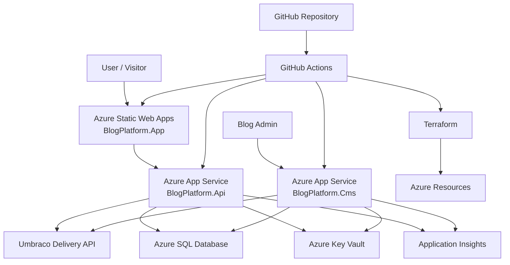
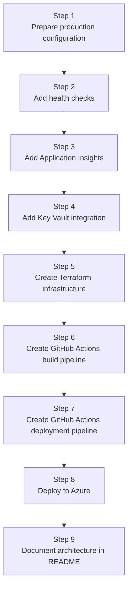
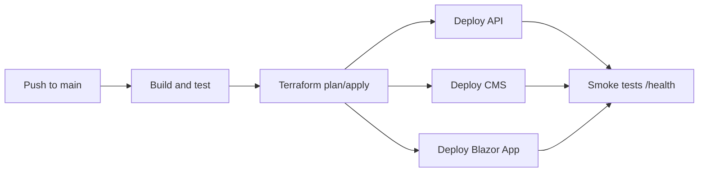

# Azure Deployment Roadmap

## Goal

Deploy BlogPlatform to Azure as a real cloud portfolio project showing:

* .NET backend deployment
* Blazor WebAssembly hosting
* Umbraco CMS hosting
* Azure SQL Database
* Terraform Infrastructure as Code
* GitHub Actions CI/CD
* Azure Key Vault
* Application Insights
* Health checks

---

## Target Architecture



---

## Roadmap Order



---

## Step 1 — Prepare Production Configuration

Goal: remove local-only assumptions.

Tasks:

* configure production API base URL for `BlogPlatform.App`
* configure production CMS URL for `BlogPlatform.Api`
* move secrets out of `appsettings.json`
* keep only safe defaults in source control
* prepare `appsettings.Production.json` where needed

Expected result:

The app can run locally and in Azure using different configuration values.

---

## Step 2 — Add Health Checks

Goal: make API and CMS cloud-monitorable.

Add endpoints:

```text
/health
/health/live
/health/ready
```

Use them for:

* Azure availability checks
* deployment validation
* CI/CD smoke tests
* easier debugging

---

## Step 3 — Add Application Insights

Goal: show production observability.

Track:

* requests
* exceptions
* dependency calls
* performance
* failed API calls
* startup errors

This turns the project from “it runs” into “it is operated like a real cloud app”.

---

## Step 4 — Add Azure Key Vault

Goal: secure production secrets.

Move these values to Key Vault:

* SQL connection string
* Umbraco HMAC secret
* any future API keys
* any CMS/admin secrets

Use Managed Identity from App Service to access Key Vault.

---

## Step 5 — Create Terraform Infrastructure

Goal: make Azure environment reproducible.

Suggested structure:

```text
infra/
  main.tf
  variables.tf
  outputs.tf
  resource-group.tf
  app-service-plan.tf
  app-service-api.tf
  app-service-cms.tf
  static-web-app.tf
  sql.tf
  key-vault.tf
  application-insights.tf
```

Terraform should create:

* Resource Group
* App Service Plan
* API App Service
* CMS App Service
* Static Web App
* Azure SQL Server
* Azure SQL Database
* Key Vault
* Application Insights
* managed identities
* app settings

---

## Step 6 — Add GitHub Actions Build Pipeline

Goal: prove the repo builds automatically.

Pipeline should:

* restore NuGet packages
* build solution
* run architecture tests
* publish API artifact
* publish CMS artifact
* publish Blazor App artifact

---

## Step 7 — Add GitHub Actions Deployment Pipeline

Goal: deploy automatically to Azure.

Deployment flow:



---

## Step 8 — Deploy to Azure

Recommended Azure services:

| Component        | Azure Service         |
| ---------------- | --------------------- |
| BlogPlatform.App | Azure Static Web Apps |
| BlogPlatform.Api | Azure App Service     |
| BlogPlatform.Cms | Azure App Service     |
| Database         | Azure SQL Database    |
| Secrets          | Azure Key Vault       |
| Monitoring       | Application Insights  |
| CI/CD            | GitHub Actions        |
| Infrastructure   | Terraform             |

---

## Step 9 — README Portfolio Story

Final portfolio message:

> BlogPlatform is a Clean Architecture .NET cloud project deployed to Azure using Blazor WebAssembly, ASP.NET Core API, Umbraco CMS, Azure SQL Database, Key Vault, Application Insights, Terraform Infrastructure as Code, and GitHub Actions CI/CD.
