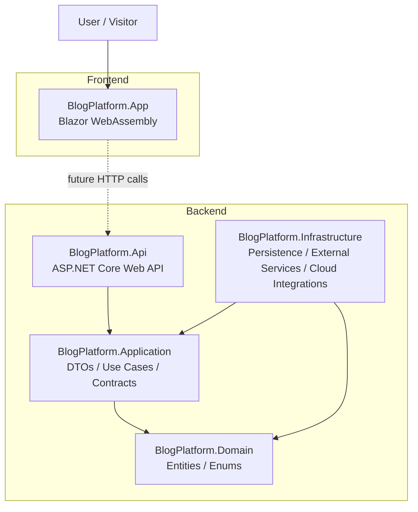
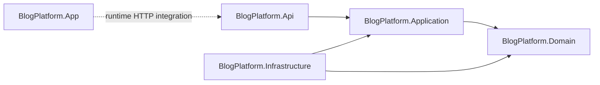
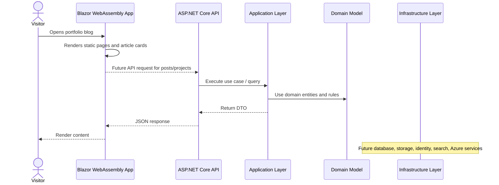
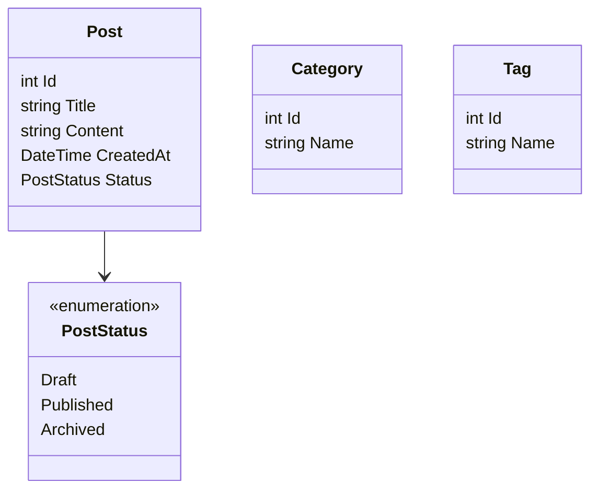
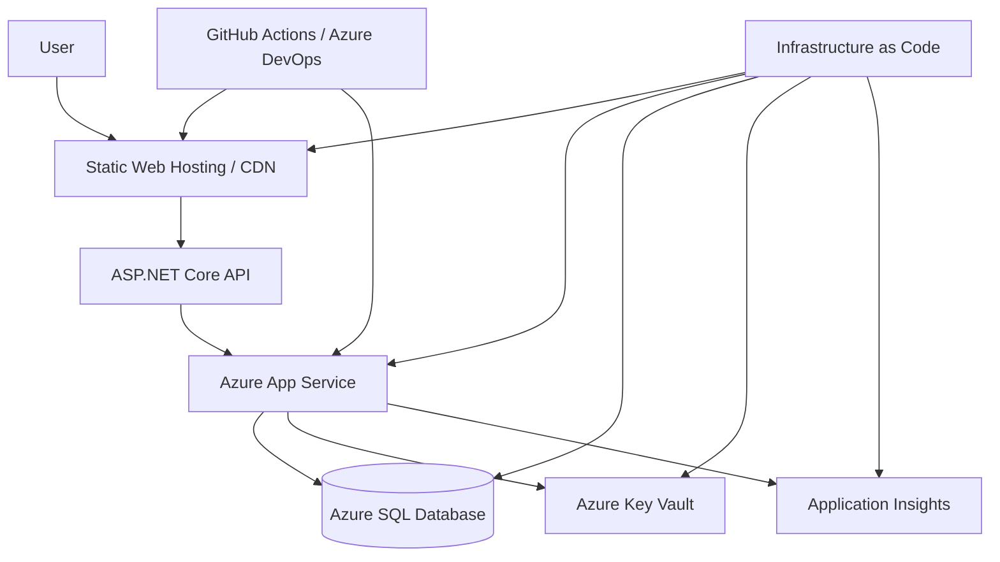

# .NET Cloud Blog Platform

A cloud-oriented portfolio blog platform built with **.NET**, **Blazor WebAssembly**, and **ASP.NET Core**.

The project is designed as a practical engineering portfolio that demonstrates backend structure, clean architecture thinking, API design, documentation, and a future path toward Azure deployment, CI/CD, and Infrastructure as Code.

It is not only a blog application.

It is a technical portfolio system for documenting engineering decisions, architecture, cloud-readiness, and implementation progress.

---

## Project Status

Current state: **early-stage portfolio platform / architecture foundation**.

The solution already contains:

- Blazor WebAssembly frontend application
- ASP.NET Core Web API project
- Application layer with DTOs
- Domain layer with core entities and enums
- Infrastructure project prepared for future persistence/cloud integrations
- Swagger/OpenAPI support in the API
- Static portfolio content focused on .NET backend, cloud, DevOps, and architecture

Planned evolution:

- Replace static/sample data with real application services
- Add persistence in the Infrastructure layer
- Add authentication and authorization
- Add automated tests
- Add CI/CD pipeline
- Add Azure deployment and infrastructure automation
- Expand documentation with architecture decision records and diagrams

---

## Solution Structure

```text
src/
└── BlogPlatform/
    ├── BlogPlatform.Api/
    │   ├── Controllers/
    │   ├── Program.cs
    │   └── appsettings.json
    │
    ├── BlogPlatform.App/
    │   ├── Layout/
    │   ├── Pages/
    │   ├── Shared/
    │   ├── wwwroot/
    │   └── Program.cs
    │
    ├── BlogPlatform.Application/
    │   └── Posts/
    │
    ├── BlogPlatform.Domain/
    │   ├── Entities/
    │   └── Enums/
    │
    ├── BlogPlatform.Infrastructure/
    │
    └── BlogPlatform.slnx
```

---

## Projects Summary

| Project | Type | Responsibility | Current Content | My Experience |
|---|---|---|---|---|
| `BlogPlatform.App` | Blazor WebAssembly frontend | Portfolio blog UI, pages, navigation, article cards, category filtering | Home, About, Projects, Article Details, shared components, CSS | Frontend understanding |
| `BlogPlatform.Api` | ASP.NET Core Web API | HTTP API boundary for backend capabilities | `PostsController`, Swagger/OpenAPI, controller setup | Backend foundation and REST API |
| `BlogPlatform.Application` | Application layer | DTOs, use cases, application contracts, orchestration | `PostDto` | Clean architecture and separation of concerns |
| `BlogPlatform.Domain` | Domain layer | Core business model independent from frameworks | `Post`, `Category`, `Tag`, `PostStatus` | Domain modeling and architecture discipline |
| `BlogPlatform.Infrastructure` | Infrastructure layer | Future persistence, external services, cloud integrations | Project shell with references to Application and Domain | Cloud/platform Engineering |
| `tests` | Test area | Future automated tests | Placeholder README | Production-quality engineering |
| `infra` | Infrastructure area | Future IaC and deployment resources | Placeholder README | Platform engineering |
| `docs` | Documentation area | Future technical documentation and diagrams | Placeholder README | Solution architecture communication skills |

---

## Architecture Overview

The repository follows a layered architecture inspired by **Clean Architecture**.



### Dependency Direction



The main rule is that the **Domain** layer remains independent. Application logic should depend on the domain model, while infrastructure details should stay outside the core business model.

---

## Runtime Flow



---

## Technology Stack

| Area | Technology |
|---|---|
| Frontend | Blazor WebAssembly |
| Backend | ASP.NET Core Web API |
| Language | C# |
| Runtime | .NET 10 target framework |
| API Documentation | Swagger / Swashbuckle |
| Architecture | Layered / Clean Architecture foundation |
| Future Cloud Direction | Azure App Service, Azure Storage, Key Vault, CI/CD, IaC |

---

## Dependencies

### `BlogPlatform.Api`

| Package | Version | Purpose |
|---|---:|---|
| `Microsoft.AspNetCore.OpenApi` | `10.0.5` | OpenAPI support |
| `Swashbuckle.AspNetCore` | `10.1.7` | Swagger UI and API documentation |

Project reference:

```text
BlogPlatform.Api → BlogPlatform.Application
```

### `BlogPlatform.App`

| Package | Version | Purpose |
|---|---:|---|
| `Microsoft.AspNetCore.Components.WebAssembly` | `10.0.5` | Blazor WebAssembly runtime |
| `Microsoft.AspNetCore.Components.WebAssembly.DevServer` | `10.0.5` | Local development server |

### `BlogPlatform.Application`

Project reference:

```text
BlogPlatform.Application → BlogPlatform.Domain
```

### `BlogPlatform.Infrastructure`

Project references:

```text
BlogPlatform.Infrastructure → BlogPlatform.Application
BlogPlatform.Infrastructure → BlogPlatform.Domain
```

---

## Domain Model

The current domain model is intentionally small and focused on the blog/content concept.



Current entities:

| Entity | Purpose |
|---|---|
| `Post` | Represents a blog/article entry |
| `Category` | Represents a content category |
| `Tag` | Represents a content tag |
| `PostStatus` | Defines post lifecycle state: draft, published, archived |

---

## Current API

The API currently exposes a sample posts endpoint.

| Method | Endpoint | Description |
|---|---|---|
| `GET` | `/api/posts` | Returns a sample list of posts |

Current sample response concept:

```json
[
  {
    "id": 1,
    "title": "First post",
    "content": "Hello from .NET API"
  }
]
```

Swagger is enabled in the Development environment.

---

## Frontend Features

The Blazor WebAssembly application currently includes:

- Home page with engineering positioning
- Category navigation:
  - Backend (.NET)
  - Cloud & DevOps
  - Architecture
- Article cards with title, summary, level, focus, and tech stack
- Article details page based on slug routing
- About page focused on .NET backend and cloud engineering
- Projects page explaining the portfolio purpose
- Shared layout and reusable post card component

---

## How to Run Locally

### Prerequisites

- .NET SDK compatible with `net10.0`
- Git

### Run the API

```bash
cd src/BlogPlatform/BlogPlatform.Api
dotnet run
```

Default launch URLs from the repository:

```text
http://localhost:5083
https://localhost:7214
```

Swagger UI is available in Development mode.

### Run the Blazor App

```bash
cd src/BlogPlatform/BlogPlatform.App
dotnet run
```

Default launch URLs from the repository:

```text
http://localhost:5016
https://localhost:7252
```

---

## Recommended Next Steps

### 1. Connect the frontend to the API

Currently the frontend uses static in-memory article data. The next practical step is to move post data behind the API and consume it from the Blazor app using `HttpClient`.

### 2. Add application services

Introduce use cases such as:

- `GetPostsQuery`
- `GetPostBySlugQuery`
- `CreatePostCommand`
- `UpdatePostCommand`
- `PublishPostCommand`

### 3. Add persistence

Use the Infrastructure layer for:

- Entity Framework Core
- SQL Server or PostgreSQL
- repository/query implementations
- migrations

### 4. Add automated tests

Recommended test layers:

- Domain tests
- Application service tests
- API endpoint tests
- Blazor component tests if needed

### 5. Add CI/CD

A good portfolio pipeline should include:

- restore
- build
- test
- publish artifacts
- deploy to Azure

### 6. Add Azure infrastructure

Good next Azure targets:

- Azure App Service for API
- Static Web Apps or App Service for frontend
- Azure SQL Database
- Azure Key Vault
- Application Insights
- Storage Account

### 7. Add documentation

Recommended documentation files:

```text
docs/
├── architecture.md
├── deployment.md
├── ci-cd.md
├── decisions/
│   ├── 0001-clean-architecture.md
│   └── 0002-blazor-webassembly-frontend.md
└── diagrams/
```

---

## Suggested Future Architecture



---

## Portfolio Value

This repository can become a strong portfolio project because it combines:

- .NET backend engineering
- cloud-readiness
- frontend presentation
- architectural separation
- technical writing
- diagram-based communication
- CI/CD and infrastructure direction

---

## License

This project includes a `LICENSE` file in the repository.
