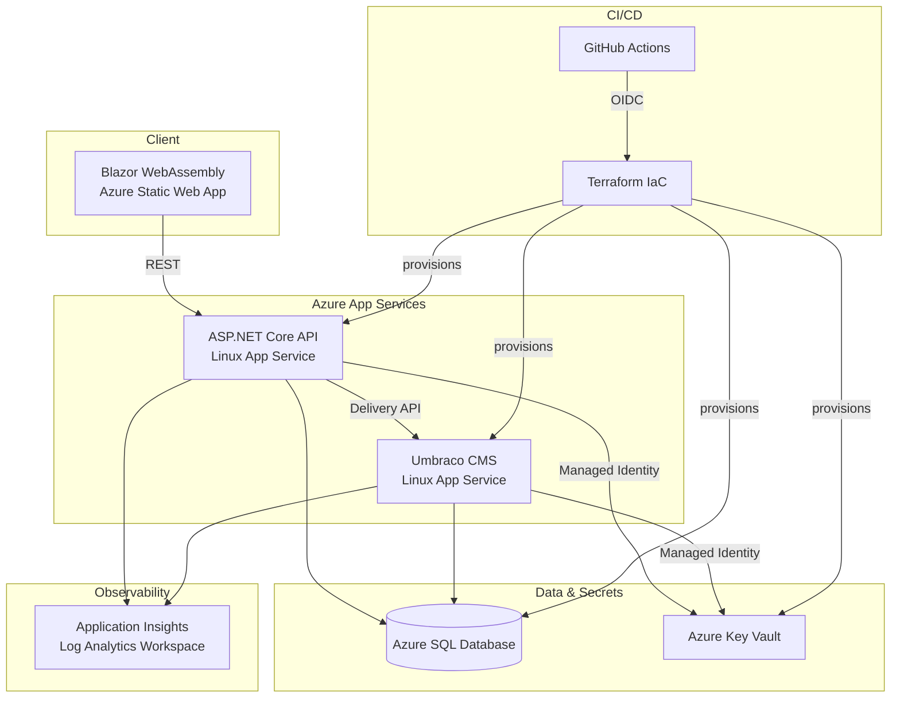
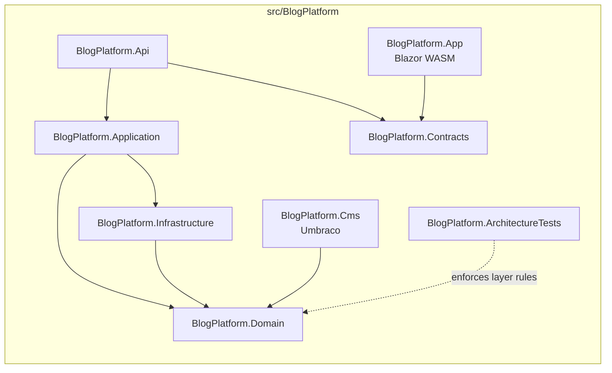

# BlogPlatform

> Cloud-native blog platform built with .NET and Azure.
> Focused on REST APIs, Clean Architecture, CI/CD, Terraform IaC, and scalable cloud design.

<!-- CI/CD Badges -->
[](https://github.com/michalantolik/dotnet-cloud-blog-platform/actions/workflows/azure-readiness.yml)
[](https://github.com/michalantolik/dotnet-cloud-blog-platform/actions/workflows/azure-terraform-plan.yml)
[](https://github.com/michalantolik/dotnet-cloud-blog-platform/actions/workflows/azure-terraform-apply.yml)
[](https://github.com/michalantolik/dotnet-cloud-blog-platform/actions/workflows/azure-deploy.yml)
[](https://github.com/michalantolik/dotnet-cloud-blog-platform/actions/workflows/azure-verify.yml)

---

## Architecture



### Application layer breakdown



---

## Tech stack

| Area | Technology |
|---|---|
| Backend API | ASP.NET Core (.NET) |
| Frontend | Blazor WebAssembly |
| CMS | Umbraco |
| Database | Azure SQL / SQL Server |
| IaC | Terraform |
| CI/CD | GitHub Actions |
| Secrets | Azure Key Vault + Managed Identity |
| Auth (CI) | GitHub OIDC — no stored secrets |
| Observability | Application Insights, Log Analytics |
| Architecture | Clean Architecture + layer enforcement tests |

---

## CI/CD pipeline

The full deployment chain runs in this order:

| Step | Workflow | Trigger |
|---|---|---|
| 1 | `azure-readiness.yml` — build, test, Terraform validate | Push / PR / manual |
| 2 | `azure-terraform-plan.yml` — plan against Azure remote state | Manual |
| 3 | `azure-terraform-apply.yml` — provision infrastructure | Manual |
| 4 | `azure-deploy.yml` — deploy API, CMS, Blazor + smoke checks | Manual |
| 5 | `azure-seed-content.yml` — seed CMS content, refresh API cache | Manual |
| 6 | `azure-verify.yml` — end-to-end verification | Manual |

Azure authentication uses **GitHub OIDC federation** — no Azure client secret is stored in GitHub.

---

## Solution structure

```
.
├── .github/
│   └── workflows/
│       ├── azure-readiness.yml
│       ├── azure-terraform-plan.yml
│       ├── azure-terraform-apply.yml
│       ├── azure-deploy.yml
│       ├── azure-seed-content.yml
│       └── azure-verify.yml
├── docs/
│   ├── README.md
│   └── secrets-and-configuration.md
├── infra/
│   ├── backend.tf
│   ├── main.tf
│   ├── outputs.tf
│   ├── terraform.tfvars.example
│   ├── variables.tf
│   └── versions.tf
├── src/
│   └── BlogPlatform/
│       ├── BlogPlatform.Api/
│       ├── BlogPlatform.App/
│       ├── BlogPlatform.Application/
│       ├── BlogPlatform.ArchitectureTests/
│       ├── BlogPlatform.Cms/
│       ├── BlogPlatform.Contracts/
│       ├── BlogPlatform.Domain/
│       ├── BlogPlatform.Infrastructure/
│       └── BlogPlatform.slnx
├── tests/
└── AZURE.md
```

---

## Main projects

| Project | Purpose |
|---|---|
| `BlogPlatform.App` | Blazor WebAssembly frontend |
| `BlogPlatform.Api` | Public REST API consumed by the frontend |
| `BlogPlatform.Cms` | Umbraco CMS — blog content administration |
| `BlogPlatform.Application` | Application services and use cases |
| `BlogPlatform.Domain` | Domain entities, value objects, and enums |
| `BlogPlatform.Infrastructure` | SQL Server persistence, CMS API client, infrastructure services |
| `BlogPlatform.Contracts` | Shared DTOs and API contracts |
| `BlogPlatform.ArchitectureTests` | Clean Architecture dependency rule enforcement |

---

## Azure infrastructure

Terraform provisions and manages:

- Resource Group
- Log Analytics Workspace + Application Insights
- Azure Key Vault (with Managed Identity access policies)
- Azure SQL Server + SQL Database
- Azure App Service Plan (Linux)
- API App Service + CMS App Service
- Azure Static Web App
- System-assigned Managed Identities for API and CMS
- Remote Terraform state backend (Azure Storage)

See [`AZURE.md`](AZURE.md) for the full deployment roadmap and `infra/README.md` for Terraform details.

---

## Runtime components

| Component | Local | Azure |
|---|---|---|
| Blazor App | Blazor WebAssembly (local) | Azure Static Web App |
| API | ASP.NET Core Web API | Linux App Service |
| CMS | Umbraco | Linux App Service |
| Database | LocalDB / SQL Server | Azure SQL Database |
| Secrets | n/a locally | Azure Key Vault |
| Telemetry | Optional | Application Insights |

---

## Local development

```bash
# Restore, build, and test
dotnet restore src/BlogPlatform/BlogPlatform.slnx
dotnet build src/BlogPlatform/BlogPlatform.slnx
dotnet test src/BlogPlatform/BlogPlatform.slnx

# Run each component
dotnet run --project src/BlogPlatform/BlogPlatform.Api/BlogPlatform.Api.csproj
dotnet run --project src/BlogPlatform/BlogPlatform.Cms/BlogPlatform.Cms.csproj
dotnet run --project src/BlogPlatform/BlogPlatform.App/BlogPlatform.App.csproj
```

---

## Health checks

| Service | Endpoints |
|---|---|
| API | `/health` · `/health/live` · `/health/ready` |
| CMS | `/health` · `/health/live` · `/health/ready` |

---

## Security

- **GitHub OIDC** — Azure authentication with no stored client secrets
- **Azure Key Vault** — runtime secrets (connection strings, keys)
- **Managed Identity** — App Services access Key Vault without credentials
- **Terraform variables** — sensitive values never committed (`.tfvars` gitignored)
- **Remote state** — Terraform state stored in Azure Storage with state locking

---

## Documentation

| File | Purpose |
|---|---|
| [`AZURE.md`](AZURE.md) | Azure deployment roadmap and current status |
| [`docs/README.md`](docs/README.md) | Documentation index |
| [`docs/secrets-and-configuration.md`](docs/secrets-and-configuration.md) | Secrets and configuration flow |
| [`infra/README.md`](infra/README.md) | Terraform infrastructure details |
| [`src/README.md`](src/README.md) | Source code structure |
| [`tests/README.md`](tests/README.md) | Test documentation |
