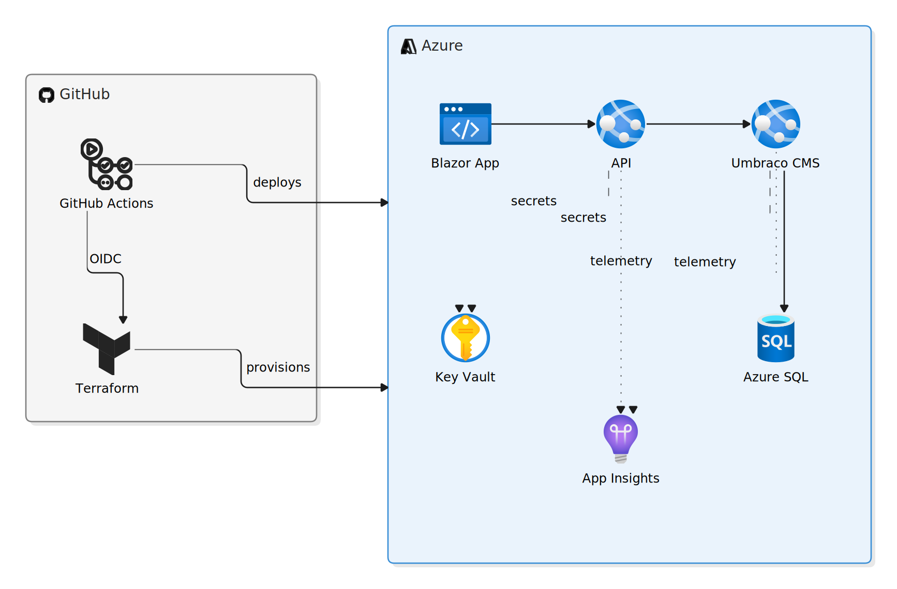
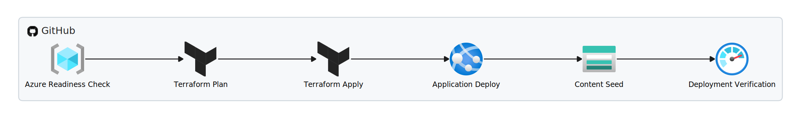

# Zone 55
Personal blog platform demonstrating Clean Architecture, Azure Cloud, Terraform Infrastructure as Code and GitHub Actions CI/CD.

The platform allows authors of software learning content to create and manage educational articles.

The project showcases how a content platform can be deployed, secured, and operated using modern Azure cloud engineering practices.

## 

<!-- CI/CD Badges -->
[](https://github.com/michalantolik/dotnet-cloud-blog-platform/actions/workflows/azure-readiness.yml)
[](https://github.com/michalantolik/dotnet-cloud-blog-platform/actions/workflows/azure-terraform-plan.yml)
[](https://github.com/michalantolik/dotnet-cloud-blog-platform/actions/workflows/azure-terraform-apply.yml)
[](https://github.com/michalantolik/dotnet-cloud-blog-platform/actions/workflows/azure-deploy.yml)
[](https://github.com/michalantolik/dotnet-cloud-blog-platform/actions/workflows/azure-verify.yml)

---

## Live Azure environment

The application is deployed to Azure using Terraform and GitHub Actions CI/CD.

| Service | URL |
|---|---|
| Blazor frontend | https://happy-mud-04e739f03.7.azurestaticapps.net/ |
| ASP.NET Core API | https://app-blogplatform-dev-api.azurewebsites.net/ |
| API health check | https://app-blogplatform-dev-api.azurewebsites.net/health/ready |
| Umbraco CMS | https://app-blogplatform-dev-cms.azurewebsites.net/umbraco |
| Umbraco blog admin | https://app-blogplatform-dev-cms.azurewebsites.net/blog-admin |

---

## What this project proves

- Clean Architecture principles
- Cloud-native application design
- Infrastructure as Code with Terraform
- Automated CI/CD with GitHub Actions
- Azure deployment and operations
- Production-ready engineering practices

---

## Architecture overview

The platform consists of a Blazor WebAssembly frontend, ASP.NET Core API, and Umbraco CMS deployed on Azure. Infrastructure is provisioned with Terraform and delivered through GitHub Actions CI/CD using OIDC authentication.



Key architectural decisions:
- Infrastructure provisioned using Terraform
- CI/CD implemented with GitHub Actions + OIDC
- Secrets stored in Azure Key Vault
- Applications authenticate using Managed Identity
- Observability provided by Application Insights

See also:
- [Detailed Azure Architecture (Deployment, Security, Observability)](docs/architecture/azure-architecture-detailed-v5.svg)
- [C4 Architecture View](docs/architecture/c4-architecture.svg)

---

## What this project covers

| Area | Details |
|---|---|
| Application architecture | Clean architecture applied |
| Architecture governance | NetArchTest clean architecture rules enforced in CI |
| Headless CMS | Umbraco 14 with Delivery API, custom block types, and content seeding |
| Azure infrastructure | Terraform-provisioned App Services, Static Web App, SQL, Key Vault |
| Secret management | Azure Key Vault + Managed Identity — no credentials in code or config |
| CI/CD authentication | GitHub Actions with OIDC — no long-lived Azure secrets stored in GitHub |
| Infrastructure as Code | Full Azure environment reproducible from `Azure Terraform apply` GitHub Action |
| Local development | Docker Compose stack: API + CMS + Blazor + SQL Server |
| Observability | Application Insights + Log Analytics + structured Serilog logging |
| Deployment verification | Post-deploy health checks and smoke tests in GitHub Actions |

---

## Architecture decisions

Key decisions are recorded as Architecture Decision Records (ADRs).

| ADR | Decision | Summary |
|---|---|---|
| [ADR-0001](docs/adr/0001-use-clean-architecture.md) | Clean Architecture | Separates Domain, Application, Infrastructure, API, CMS, and Frontend into distinct layers with enforced dependency direction |
| [ADR-0002](docs/adr/0002-use-terraform-and-github-oidc.md) | Terraform + GitHub OIDC | Infrastructure is version-controlled and reproducible; pipelines authenticate via OIDC instead of storing Azure credentials |
| [ADR-0003](docs/adr/0003-use-key-vault-managed-identity.md) | Key Vault + Managed Identity | Production secrets stored in Azure Key Vault, accessed by App Services via system-assigned Managed Identity |

See [`docs/adr/`](docs/adr/) for the full index.

---

## Azure deployment pipeline

The azure deployment pipeline runs in this order:



See also:
- [Detailed Azure Deployment Pipeline](docs/architecture/azure-deployment-detailed-v5.svg)

---

## Technology stack

### Application

| Layer | Technology |
|---|---|
| Frontend | Blazor WebAssembly (.NET 10) |
| API | ASP.NET Core Web API (.NET 10) |
| CMS | Umbraco 14 (Delivery API) |
| ORM / DB Access | Entity Framework Core |
| Database | Azure SQL (MSSQL) |
| Logging | Serilog → Application Insights + file sink |
| Observability | Azure Application Insights + Log Analytics Workspace |

### Infrastructure & DevOps

| Concern | Technology |
|---|---|
| Cloud | Microsoft Azure |
| Infrastructure as Code | Terraform |
| CI/CD | GitHub Actions |
| Azure authentication (pipeline) | GitHub OIDC |
| Secret management | Azure Key Vault + Managed Identity |
| Container runtime (local) | Docker / Docker Compose |
| Frontend hosting | Azure Static Web App |
| Backend hosting | Azure App Service (Linux, B1) |

### Architecture & Quality

| Concern | Approach |
|---|---|
| Application architecture | Clean Architecture |
| Dependency enforcement | `BlogPlatform.ArchitectureTests` (NetArchTest) |
| Deployment verification | Post-deploy smoke test workflow (`azure-verify.yml`) |

---

## Security

Secret and configuration management is documented in:

**[docs/secrets-and-configuration.md](docs/secrets-and-configuration.md)**

Key points:

- Production secrets live in **Azure Key Vault** — not in `appsettings`, GitHub secrets, or Docker images
- App Services access Key Vault via **system-assigned Managed Identity** — no stored credentials
- GitHub Actions authenticate to Azure via **OIDC federation** — no long-lived `AZURE_CLIENT_SECRET`
- Local development uses `.env` files (git-ignored) — see `.env.example`

---

## Local development

**[docs/DOCKER.md](docs/DOCKER.md)**

```bash
cp .env.example .env
docker compose up --build
```

| Service | URL |
|---|---|
| Blazor frontend | http://localhost:8080 |
| ASP.NET Core API | http://localhost:5000 |
| Umbraco backoffice | http://localhost:5001/umbraco |

Allow ~2–3 minutes on first boot for Umbraco's unattended install to complete.

---

## Lessons learned

### Why Clean Architecture?

A blog platform could be a single project. Splitting into layers keeps business logic independent of infrastructure — the CMS can be swapped, the database can be replaced, and the API surface stays unchanged. `BlogPlatform.ArchitectureTests` enforces dependency direction automatically; a PR that violates the rules fails the build. The trade-off is more projects and more ceremony for simple features, which is worth it when the structure itself is part of what's being explored.

### Why Terraform?

Running `terraform apply` against a blank Azure subscription should produce a fully working environment — and it does. Infrastructure changes go through pull request review the same way application code does. Clicking through the Azure portal produces something that works once but can't be reviewed, diffed, or reliably recreated.

### Why OIDC?

GitHub OIDC lets a workflow authenticate to Azure without a password. At runtime the workflow requests a short-lived token; Azure validates it against a configured trust relationship in Entra ID. There is no `AZURE_CLIENT_SECRET` to rotate, expire, or accidentally log. Long-lived credentials in CI/CD pipelines are a common source of exposure — OIDC removes that from the picture for Azure access.

### Why Key Vault?

A secret in `appsettings.Production.json`, a Dockerfile layer, or a GitHub Actions variable can end up in source history, a container registry, or a workflow log. Key Vault keeps production secrets out of all of those paths. The API and CMS never hold credentials — they request secrets at startup via their Azure Managed Identity, and Key Vault responds based on access policy.

### Why Managed Identity?

The alternative is a service principal with a client secret — another credential that needs storing, rotating, and protecting. With Managed Identity, Azure manages the identity and its lifecycle. The App Service authenticates by virtue of running in Azure; no password is exchanged or stored anywhere.

---

## Repository structure

```
.
├── .github/workflows/                # CI/CD pipeline definitions
├── docs/
│   ├── adr/                          # Architecture Decision Records
│   ├── architecture/                 # Detailed architecture documentation
│   ├── DOCKER.md                     # Local development guide
│   └── secrets-and-configuration.md
├── infra/                            # Terraform configuration
├── src/
│   └── BlogPlatform/
│       ├── BlogPlatform.Api/             # ASP.NET Core Web API
│       ├── BlogPlatform.App/             # Blazor WebAssembly frontend
│       ├── BlogPlatform.Application/     # Application services and interfaces
│       ├── BlogPlatform.ArchitectureTests/
│       ├── BlogPlatform.Cms/             # Umbraco CMS
│       ├── BlogPlatform.Contracts/       # Shared DTOs
│       ├── BlogPlatform.Domain/          # Domain model
│       └── BlogPlatform.Infrastructure/  # SQL + CMS integration
├── AZURE.md
├── docker-compose.yml
├── Dockerfile.api
├── Dockerfile.app
├── Dockerfile.cms
└── .env.example
```

---

## License

<!-- License Badge -->
[](LICENSE)
