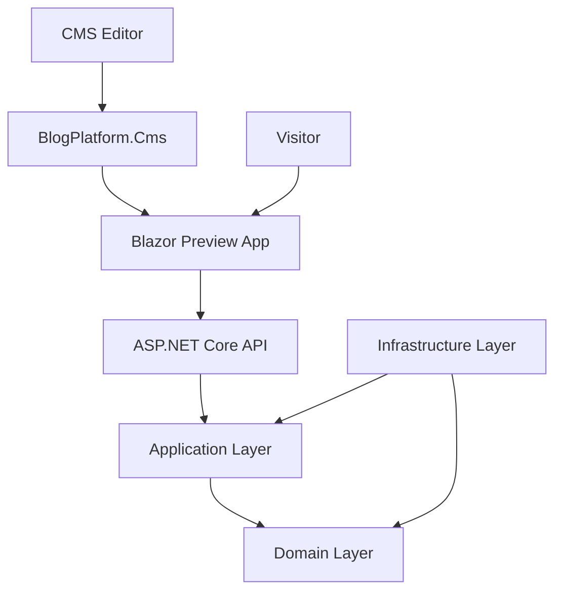
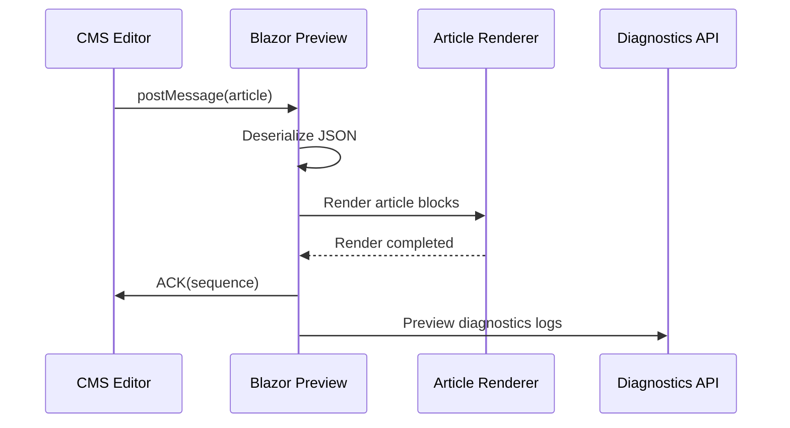

# .NET Cloud Blog Platform

A cloud-oriented engineering blog platform built with:

- .NET 10
- Blazor WebAssembly
- ASP.NET Core Web API
- Umbraco CMS
- layered / clean architecture principles

The repository is designed as a practical engineering portfolio platform focused on:

- backend engineering
- architecture communication
- cloud readiness
- CMS integration
- rendering systems
- diagnostics and observability
- future Azure deployment
- CI/CD and Infrastructure as Code

This is not only a blog.

It is an engineering platform used to experiment with:
- rendering pipelines
- content management
- architectural structure
- developer tooling
- diagnostics
- frontend/backend integration
- technical documentation workflows

---

# Current State

Current state:

**working engineering portfolio platform with CMS-side live preview system**

The repository currently contains:

- Blazor WebAssembly frontend
- ASP.NET Core Web API
- Umbraco CMS integration
- layered architecture foundation
- markdown-based article rendering
- article component rendering system
- code block rendering
- live article preview
- iframe synchronization pipeline
- preview diagnostics and observability
- preview ACK/message synchronization
- Swagger/OpenAPI
- static engineering portfolio content
- LocalDB-based CMS setup

---

# Key Implemented Features

## Live Article Preview

The platform now contains a fully working CMS-style live article preview system.

Architecture:

```text
CMS Editor
    ↓
postMessage()
    ↓
Blazor Preview App (iframe)
    ↓
Deserialize Article
    ↓
Render Components
    ↓
ACK Response
    ↓
Diagnostics Logging
```

Implemented features:

- live iframe preview updates
- debounced editor synchronization
- preview ACK pipeline
- preview diagnostics logging
- render sequence tracking
- render key invalidation
- safe logging without recursion
- runtime preview synchronization
- markdown/code block rendering

The preview system was intentionally designed as a realistic engineering exercise focused on:
- frontend/backend communication
- runtime synchronization
- diagnostics
- rendering lifecycle debugging
- state invalidation problems
- production troubleshooting

---

# Solution Structure

```text
src/
└── BlogPlatform/
    ├── BlogPlatform.Api/
    ├── BlogPlatform.App/
    ├── BlogPlatform.Application/
    ├── BlogPlatform.Cms/
    ├── BlogPlatform.Domain/
    ├── BlogPlatform.Infrastructure/
    └── BlogPlatform.slnx
```

---

# Projects Summary

| Project | Responsibility |
|---|---|
| `BlogPlatform.App` | Blazor WebAssembly frontend, article rendering, live preview iframe |
| `BlogPlatform.Api` | ASP.NET Core API, diagnostics endpoints, future backend services |
| `BlogPlatform.Cms` | Umbraco CMS and CMS-side editor shell |
| `BlogPlatform.Application` | application contracts and DTOs |
| `BlogPlatform.Domain` | domain entities and enums |
| `BlogPlatform.Infrastructure` | future persistence/cloud integrations |
| `docs` | architecture and engineering documentation |
| `infra` | future IaC/deployment resources |
| `tests` | future automated tests |

---

# Architecture Overview



---

# Live Preview Runtime Flow



---

# Technology Stack

| Area | Technology |
|---|---|
| Frontend | Blazor WebAssembly |
| Backend | ASP.NET Core Web API |
| CMS | Umbraco CMS |
| Language | C# |
| Runtime | .NET 10 |
| API Docs | Swagger |
| Rendering | Markdown + Blazor components |
| Communication | iframe + postMessage |
| Diagnostics | API-based preview diagnostics |
| Architecture | Layered / Clean Architecture foundation |
| Future Cloud | Azure |

---

# Current Frontend Features

The frontend currently includes:

- engineering-themed UI
- article rendering system
- article detail pages
- category navigation
- reusable rendering components
- markdown rendering
- code block rendering
- PlantUML/Mermaid integration foundation
- live preview rendering
- preview diagnostics overlay
- iframe synchronization

---

# CMS Features

`BlogPlatform.Cms` currently provides:

- CMS editor shell
- live preview iframe integration
- editor-to-preview synchronization
- debounced live updates
- ACK-based preview confirmation
- preview lifecycle diagnostics

---

# Diagnostics and Observability

The repository now includes a lightweight diagnostics pipeline used for preview troubleshooting.

Features:

- render sequence tracking
- preview ACK tracking
- iframe synchronization logging
- render lifecycle logging
- safe diagnostics transport
- recursion-safe logging strategy

The diagnostics pipeline was intentionally separated from the standard application logger to avoid infinite recursive logging loops.

---

# Engineering Topics Demonstrated

This repository intentionally demonstrates practical engineering topics such as:

- layered architecture
- runtime synchronization
- iframe communication
- diagnostics-first troubleshooting
- rendering pipelines
- state invalidation debugging
- component rendering
- CMS/frontend integration
- architecture documentation
- developer tooling
- observability mindset

---

# Current API

Current endpoints include:

| Method | Endpoint | Purpose |
|---|---|---|
| GET | `/api/posts` | sample posts |
| POST | `/api/preview-diagnostics` | preview diagnostics logging |

Swagger/OpenAPI is enabled in Development mode.

---

# How to Run

## Run API

```bash
cd src/BlogPlatform/BlogPlatform.Api
dotnet run
```

Default:

```text
https://localhost:7214
```

---

## Run Blazor App

```bash
cd src/BlogPlatform/BlogPlatform.App
dotnet run
```

Default:

```text
https://localhost:7252
```

---

## Run CMS

```bash
cd src/BlogPlatform/BlogPlatform.Cms
dotnet run
```

Default:

```text
https://localhost:44393
```

CMS editor:

```text
/blog-admin/article-editor
```

Umbraco backoffice:

```text
/umbraco
```

---

# Recommended Next Steps

## Backend

- replace static data
- add application services
- add EF Core persistence
- add authentication/authorization

## Cloud

- Azure App Service
- Azure SQL
- Key Vault
- Application Insights
- Blob Storage

## DevOps

- GitHub Actions
- Azure DevOps pipelines
- automated deployments
- IaC

## Engineering

- automated tests
- render pipeline tests
- component snapshot tests
- diagnostics dashboards
- architecture decision records

---

# Future Direction

Planned evolution:

```text
Static Portfolio
    ↓
Headless CMS Platform
    ↓
Cloud-Native Engineering Platform
    ↓
Production-Grade Portfolio System
```

Future goals:

- headless CMS architecture
- Azure deployment
- CI/CD
- Infrastructure as Code
- distributed diagnostics
- search/indexing
- article versioning
- AI-assisted content workflows

---

# Portfolio Value

This repository demonstrates practical experience with:

- .NET backend engineering
- Blazor WebAssembly
- architecture design
- runtime debugging
- diagnostics
- rendering systems
- CMS integration
- cloud-oriented thinking
- developer tooling
- frontend/backend synchronization

The project intentionally emphasizes engineering depth and troubleshooting capability rather than only visual UI work.

---

# License

This repository contains a LICENSE file.
