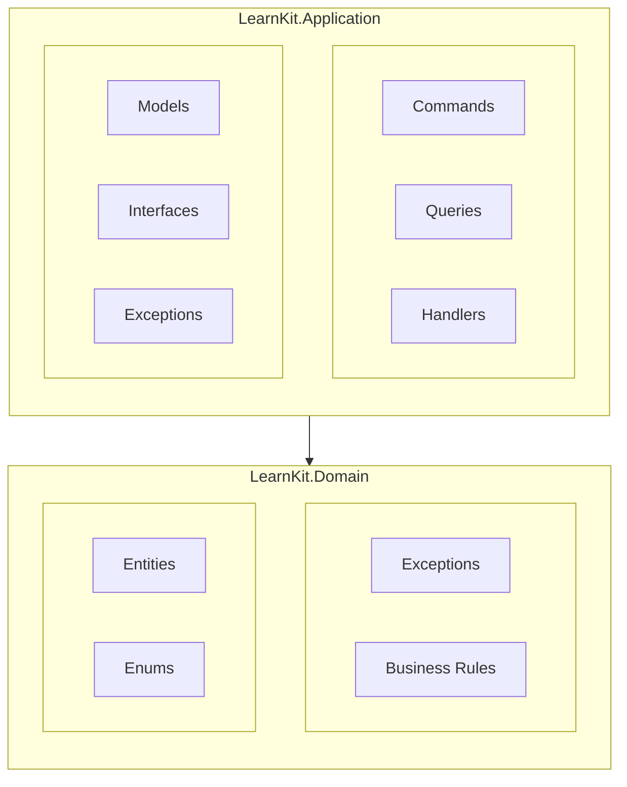

# Zone55 Platform

Zone55 is a learning-content platform built with .NET 10. LearnKit owns the content model, persistence, public API, and editorial operations. The active platform has no Umbraco runtime, package, project, database, or deployment dependency.

## Solution structure


```mermaid
flowchart TB

subgraph Domain["LearnKit.Domain"]
    direction TB

    subgraph DRow2[" "]
        direction LR
        D3[Exceptions]
        D4[Business Rules]
    end

    subgraph DRow1[" "]
        direction LR
        D1[Entities]
        D2[Enums]
    end

end

subgraph Application["LearnKit.Application"]
    direction TB

    subgraph ARow1[" "]
        direction LR
        A1[Commands]
        A2[Queries]
        A3[Handlers]
    end

    subgraph ARow2[" "]
        direction LR
        A4[Models]
        A5[Interfaces]
        A6[Exceptions]
    end
end

Application --> Domain
```

The physical source folders match the two top-level Visual Studio solution folders:

```text
src/
├── LearnKit/
└── Zone55/
```

| Project | Purpose |
|---|---|
| `LearnKit.Domain` | Learning paths, zones, steps, articles, and blocks |
| `LearnKit.Application` | Commands, queries, handlers, and application contracts |
| `LearnKit.Infrastructure` | EF Core persistence, initialization, seeding, and export |
| `Zone55.Api` | LearnKit public and management HTTP API |
| `Zone55.Portal` | Public Blazor WebAssembly portal |
| `Zone55.Management` | Blazor WebAssembly content management application |
| `Zone55.ArchitectureTests` | Architecture dependency tests |
| `Zone55.Presentation.Tests` | Portal and management presentation tests |
| `Zone55.PortfolioScreenshots` | Workflow-only Playwright screenshot tests |

Open `Zone55.slnx` from the repository root. Visual Studio displays two top-level solution folders: `LearnKit` and `Zone55`.

## Content lifecycle

```text
Zone55.Management
        ↓
Zone55.Api
        ↓
LearnKit.Application
        ↓
LearnKit.Infrastructure
        ↓
Zone55Db
```

The API applies LearnKit migrations and performs an idempotent content bootstrap on startup. The Portal and the persistent Management live preview use the same `Zone55.Portal` renderer. No separate CMS seed workflow is required.

## Local development

```bash
docker compose up --build
```

| Service | URL |
|---|---|
| Portal | http://localhost:8080 |
| Management | http://localhost:8081 |
| API | http://localhost:5000 |
| API readiness | http://localhost:5000/health/ready |

## Build and test

```bash
dotnet restore Zone55.slnx
dotnet build Zone55.slnx
dotnet test Zone55.slnx
```

## Documentation archive

Historical Markdown documentation and its diagrams are retained under [`docs/legacy`](docs/legacy/README.md). These files are marked as legacy and may refer to earlier project names or retired architecture.
