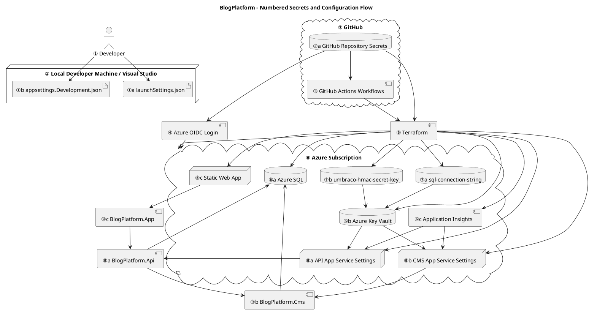

# Secrets and Configuration Guide

## Purpose

This document explains:

* Where secrets originate
* Where they are stored
* How they flow through the system
* How names map between GitHub, Terraform, Azure, Key Vault, App Services, and runtime applications
* Which component consumes each configuration value

This document should be read together with:

* README.md
* AZURE.md

---

# High-Level Overview

The system follows this flow:

1. Local development
2. GitHub repository secrets
3. GitHub Actions
4. Azure OIDC authentication
5. Terraform execution
6. Azure resources
7. Key Vault secrets
8. App Service settings
9. Runtime applications

Configuration and secrets generally flow downward from top to bottom. Troubleshooting should follow the same direction.

---

# PlantUML Diagram



---

# Configuration Layers

## ① Local Development

### Summary

Development configuration layer used to run the application locally from Visual Studio.

| Classification    | Value                     |
| ----------------- | ------------------------- |
| Layer Type        | Development Configuration |
| Stores Secrets    | Possible                  |
| Creates Secrets   | No                        |
| Consumes Secrets  | Yes                       |
| Runtime Component | No                        |

### Typical Sources

* launchSettings.json
* appsettings.Development.json
* User Secrets
* Environment Variables

### Typical Values

| Name                                 | Purpose                        |
| ------------------------------------ | ------------------------------ |
| ASPNETCORE_ENVIRONMENT               | Select Development environment |
| ConnectionStrings__umbracoDbDSN      | Local database                 |
| Umbraco__CMS__Imaging__HMACSecretKey | Development HMAC key           |

---

## ② GitHub Repository Secrets

### Summary

Primary source of encrypted deployment secrets used by CI/CD workflows.

| Classification    | Value         |
| ----------------- | ------------- |
| Layer Type        | Secret Source |
| Stores Secrets    | Yes           |
| Creates Secrets   | No            |
| Consumes Secrets  | No            |
| Runtime Component | No            |

### Secrets

| Secret Name                   | Meaning                           |
| ----------------------------- | --------------------------------- |
| AZURE_CLIENT_ID               | Azure application identity        |
| AZURE_TENANT_ID               | Azure tenant identifier           |
| AZURE_SUBSCRIPTION_ID         | Azure subscription identifier     |
| TF_STATE_RESOURCE_GROUP_NAME  | Terraform backend resource group  |
| TF_STATE_STORAGE_ACCOUNT_NAME | Terraform backend storage account |
| TF_STATE_CONTAINER_NAME       | Terraform backend blob container  |
| TF_STATE_KEY                  | Terraform state file name         |
| TF_VAR_SQL_ADMIN_LOGIN        | SQL administrator login           |
| TF_VAR_SQL_ADMIN_PASSWORD     | SQL administrator password        |

---

## ③ GitHub Actions

### Summary

CI/CD execution layer responsible for building, validating, and deploying infrastructure and applications.

| Classification    | Value           |
| ----------------- | --------------- |
| Layer Type        | CI/CD Execution |
| Stores Secrets    | No              |
| Creates Secrets   | No              |
| Consumes Secrets  | Yes             |
| Runtime Component | No              |

### Consumes

| Secret     | Purpose              |
| ---------- | -------------------- |
| AZURE_*    | Azure authentication |
| TF_STATE_* | Terraform backend    |
| TF_VAR_*   | Terraform variables  |

### Produces

| Output               | Purpose                         |
| -------------------- | ------------------------------- |
| Workflow Environment | Temporary execution environment |
| Terraform Execution  | Infrastructure deployment       |
| Azure Login Session  | Azure access                    |

---

## ④ Azure OIDC Authentication

### Summary

Authentication layer that securely connects GitHub Actions to Azure without storing passwords.

| Classification    | Value          |
| ----------------- | -------------- |
| Layer Type        | Authentication |
| Stores Secrets    | No             |
| Creates Secrets   | No             |
| Consumes Secrets  | Yes            |
| Runtime Component | No             |

### Consumes

| Secret                | Purpose              |
| --------------------- | -------------------- |
| AZURE_CLIENT_ID       | Application identity |
| AZURE_TENANT_ID       | Azure tenant         |
| AZURE_SUBSCRIPTION_ID | Azure subscription   |

### Produces

| Output             | Purpose                |
| ------------------ | ---------------------- |
| Azure Access Token | Temporary Azure access |

---

## ⑤ Terraform Execution

### Summary

Infrastructure provisioning layer responsible for creating and configuring Azure resources from code.

| Classification    | Value                       |
| ----------------- | --------------------------- |
| Layer Type        | Infrastructure Provisioning |
| Stores Secrets    | No                          |
| Creates Secrets   | Indirectly                  |
| Consumes Secrets  | Yes                         |
| Runtime Component | No                          |

### Inputs

| Variable           | Purpose                    |
| ------------------ | -------------------------- |
| sql_admin_login    | SQL administrator username |
| sql_admin_password | SQL administrator password |
| TF_STATE_*         | Terraform backend          |

### Creates

| Resource             | Purpose           |
| -------------------- | ----------------- |
| Azure SQL            | Database platform |
| Azure Key Vault      | Secret storage    |
| Application Insights | Monitoring        |
| API App Service      | Backend hosting   |
| CMS App Service      | CMS hosting       |
| Static Web App       | Frontend hosting  |

### Creates Secrets

| Secret                  | Purpose                     |
| ----------------------- | --------------------------- |
| sql-connection-string   | Runtime database connection |
| umbraco-hmac-secret-key | Runtime image signing key   |

## ⑥ Azure Resources

### Summary

Infrastructure layer hosting all Azure services required by the application.

| Classification    | Value          |
| ----------------- | -------------- |
| Layer Type        | Infrastructure |
| Stores Secrets    | Indirectly     |
| Creates Secrets   | No             |
| Consumes Secrets  | No             |
| Runtime Component | No             |

### Resources

| Resource             | Purpose                  |
| -------------------- | ------------------------ |
| Azure SQL Server     | SQL hosting              |
| Azure SQL Database   | Application data storage |
| Azure Key Vault      | Secret storage           |
| Application Insights | Monitoring and telemetry |
| API App Service      | Backend hosting          |
| CMS App Service      | Umbraco hosting          |
| Static Web App       | Blazor frontend hosting  |

---

## ⑦ Key Vault Secrets

### Summary

Centralized secure storage for runtime secrets and sensitive configuration values.

| Classification    | Value          |
| ----------------- | -------------- |
| Layer Type        | Secret Storage |
| Stores Secrets    | Yes            |
| Creates Secrets   | No             |
| Consumes Secrets  | No             |
| Runtime Component | No             |

### Secrets

| Secret Name             | Purpose                    |
| ----------------------- | -------------------------- |
| sql-connection-string   | Database connection string |
| umbraco-hmac-secret-key | Umbraco image signing key  |

### Consumers

| Consumer        | Uses                |
| --------------- | ------------------- |
| API App Service | Database connection |
| CMS App Service | Database connection |
| CMS App Service | HMAC signing key    |

---

## ⑧ App Service Settings

### Summary

Runtime configuration layer that exposes configuration values and Key Vault references to deployed applications.

| Classification    | Value                 |
| ----------------- | --------------------- |
| Layer Type        | Runtime Configuration |
| Stores Secrets    | References only       |
| Creates Secrets   | No                    |
| Consumes Secrets  | Yes                   |
| Runtime Component | No                    |

### API App Service

| Setting                               | Purpose             |
| ------------------------------------- | ------------------- |
| ConnectionStrings__umbracoDbDSN       | Database connection |
| ApplicationInsights__ConnectionString | Telemetry           |
| KeyVault__VaultUri                    | Key Vault access    |
| UmbracoDeliveryApi__BaseUrl           | CMS endpoint        |

### CMS App Service

| Setting                               | Purpose             |
| ------------------------------------- | ------------------- |
| ConnectionStrings__umbracoDbDSN       | Database connection |
| ApplicationInsights__ConnectionString | Telemetry           |
| KeyVault__VaultUri                    | Key Vault access    |
| Umbraco__CMS__Imaging__HMACSecretKey  | Image signing       |

### Static Web App

| Setting    | Purpose          |
| ---------- | ---------------- |
| ApiBaseUrl | Backend endpoint |

---

## ⑨ Runtime Applications

### Summary

Running .NET applications that consume configuration values and secrets to perform business operations.

| Classification    | Value           |
| ----------------- | --------------- |
| Layer Type        | Secret Consumer |
| Stores Secrets    | No              |
| Creates Secrets   | No              |
| Consumes Secrets  | Yes             |
| Runtime Component | Yes             |

### BlogPlatform.Api

| Setting                         | Purpose           |
| ------------------------------- | ----------------- |
| ConnectionStrings__umbracoDbDSN | SQL access        |
| KeyVault__VaultUri              | Secret access     |
| UmbracoDeliveryApi__BaseUrl     | CMS communication |

### BlogPlatform.Cms

| Setting                              | Purpose       |
| ------------------------------------ | ------------- |
| ConnectionStrings__umbracoDbDSN      | SQL access    |
| Umbraco__CMS__Imaging__HMACSecretKey | Image signing |
| KeyVault__VaultUri                   | Secret access |

### BlogPlatform.App (Blazor)

| Setting    | Purpose           |
| ---------- | ----------------- |
| ApiBaseUrl | API communication |

---

# Secret Mapping and Flow

## Secret Flow Matrix

| Secret                                | Starts Here    | Travels Through              | Ends Here                |
| ------------------------------------- | -------------- | ---------------------------- | ------------------------ |
| AZURE_CLIENT_ID                       | GitHub Secrets | GitHub Actions → Azure Login | Azure                    |
| AZURE_TENANT_ID                       | GitHub Secrets | GitHub Actions → Azure Login | Azure                    |
| AZURE_SUBSCRIPTION_ID                 | GitHub Secrets | GitHub Actions → Azure Login | Azure                    |
| TF_VAR_SQL_ADMIN_LOGIN                | GitHub Secrets | GitHub Actions → Terraform   | Azure SQL                |
| TF_VAR_SQL_ADMIN_PASSWORD             | GitHub Secrets | GitHub Actions → Terraform   | Azure SQL                |
| sql-connection-string                 | Terraform      | Key Vault                    | API Runtime, CMS Runtime |
| umbraco-hmac-secret-key               | Terraform      | Key Vault                    | CMS Runtime              |
| ApplicationInsights__ConnectionString | Azure          | App Service Settings         | Runtime Applications     |

---

## Name Mapping

### SQL Credentials

| GitHub Secret             | Terraform Variable     | Final Usage       |
| ------------------------- | ---------------------- | ----------------- |
| TF_VAR_SQL_ADMIN_LOGIN    | var.sql_admin_login    | SQL administrator |
| TF_VAR_SQL_ADMIN_PASSWORD | var.sql_admin_password | SQL administrator |

### Database Connection

| Source               | Destination                             |
| -------------------- | --------------------------------------- |
| Terraform            | Key Vault secret: sql-connection-string |
| Key Vault            | ConnectionStrings__umbracoDbDSN         |
| App Service Settings | Runtime applications                    |

### Umbraco HMAC Key

| Source               | Destination                               |
| -------------------- | ----------------------------------------- |
| Terraform            | Key Vault secret: umbraco-hmac-secret-key |
| Key Vault            | Umbraco__CMS__Imaging__HMACSecretKey      |
| App Service Settings | CMS Runtime                               |

### Azure Authentication

| Secret                | Purpose                    |
| --------------------- | -------------------------- |
| AZURE_CLIENT_ID       | Azure application identity |
| AZURE_TENANT_ID       | Azure tenant               |
| AZURE_SUBSCRIPTION_ID | Azure subscription         |

---

# Troubleshooting Guide

## Deployment Cannot Authenticate to Azure

Check in this order:

1. GitHub Repository Secrets
2. AZURE_CLIENT_ID
3. AZURE_TENANT_ID
4. AZURE_SUBSCRIPTION_ID
5. Federated Credential in Azure

---

## Terraform Cannot Access State

Check:

1. TF_STATE_RESOURCE_GROUP_NAME
2. TF_STATE_STORAGE_ACCOUNT_NAME
3. TF_STATE_CONTAINER_NAME
4. TF_STATE_KEY

---

## Application Cannot Connect to SQL

Check:

1. Key Vault contains `sql-connection-string`
2. App Service has Key Vault reference
3. Managed Identity permissions
4. Runtime configuration
5. SQL firewall rules

---

## CMS Image Signing Problems

Check:

1. Key Vault contains `umbraco-hmac-secret-key`
2. CMS App Service setting exists
3. Runtime configuration loaded correctly

---

# Quick Mental Model

Think of the system as:

```text
GitHub Secrets
        ↓
GitHub Actions
        ↓
Azure Login (OIDC)
        ↓
Terraform
        ↓
Azure Resources
        ↓
Key Vault
        ↓
App Service Settings
        ↓
Running .NET Applications
```

When troubleshooting:

```text
Top → Bottom
```

Always start at the highest layer where the value originates and follow it downward until it reaches the runtime application.

---

# Document Maintenance

Update this document whenever:

* A new GitHub Secret is added
* A new Terraform variable is added
* A new Key Vault secret is added
* A new App Service setting is added
* A new Azure resource is introduced
* A configuration flow changes

This document should remain the authoritative reference for configuration and secret management within the BlogPlatform solution.

