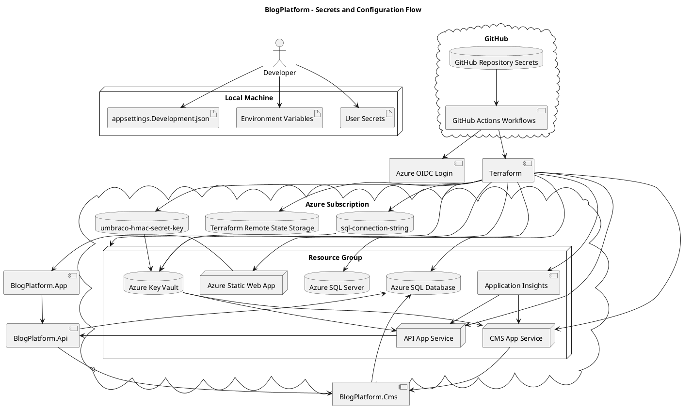

# Secrets and Configuration Guide

## Purpose

This document explains:

* Where secrets originate
* Where secrets are stored
* How secrets flow through GitHub Actions, Terraform, Azure, Key Vault, App Services, and runtime applications
* Which component consumes each configuration value
* Which values are safe to commit and which values must stay private

Read this together with:

* `../README.md`
* `../AZURE.md`
* `../infra/README.md`

---

## High-Level Flow

```text
Developer / Local Machine
        |
        v
GitHub Repository Secrets
        |
        v
GitHub Actions
        |
        v
Azure OIDC Login
        |
        v
Terraform
        |
        v
Azure Resources
        |
        v
Key Vault + App Service Settings
        |
        v
Runtime Applications
```

---

## PlantUML Diagram



---

## 1. Local Development Configuration

Local development uses:

* `appsettings.json`
* `appsettings.Development.json`
* User Secrets
* Environment variables

Local configuration is used by:

* `BlogPlatform.Api`
* `BlogPlatform.Cms`
* `BlogPlatform.App`

Typical local values:

| Configuration key | Purpose |
|---|---|
| `ConnectionStrings:umbracoDbDSN` | Local SQL Server / LocalDB connection string |
| `Umbraco:CMS:Imaging:HMACSecretKey` | Local Umbraco image HMAC key |
| `UmbracoDeliveryApi:BaseUrl` | Local CMS URL used by API |
| `Api:BaseUrl` | Local API URL used by Blazor |
| `Cors:AllowedOrigins` | Allowed frontend origins for API CORS |

---

## 2. GitHub Repository Secrets

GitHub repository secrets are used by GitHub Actions.

### Azure OIDC secrets

| Secret | Purpose |
|---|---|
| `AZURE_CLIENT_ID` | Azure app registration / federated identity client ID |
| `AZURE_TENANT_ID` | Azure tenant ID |
| `AZURE_SUBSCRIPTION_ID` | Azure subscription ID |

These are used by:

* `azure/login`
* Terraform AzureRM provider through `ARM_*` environment variables

---

### Terraform backend secrets

| Secret | Purpose |
|---|---|
| `TF_STATE_RESOURCE_GROUP_NAME` | Resource group containing Terraform state storage |
| `TF_STATE_STORAGE_ACCOUNT_NAME` | Azure Storage account for Terraform state |
| `TF_STATE_CONTAINER_NAME` | Blob container for Terraform state |
| `TF_STATE_KEY` | Terraform state blob name |

These are passed into:

```bash
terraform init \
  -backend-config="resource_group_name=..." \
  -backend-config="storage_account_name=..." \
  -backend-config="container_name=..." \
  -backend-config="key=..."
```

---

### Terraform variable secrets

| GitHub secret | Terraform variable |
|---|---|
| `TF_VAR_SQL_ADMIN_LOGIN` | `sql_admin_login` |
| `TF_VAR_SQL_ADMIN_PASSWORD` | `sql_admin_password` |
| `TF_VAR_UMBRACO_ADMIN_NAME` | `umbraco_admin_name` |
| `TF_VAR_UMBRACO_ADMIN_EMAIL` | `umbraco_admin_email` |
| `TF_VAR_UMBRACO_ADMIN_PASSWORD` | `umbraco_admin_password` |

The workflows map them as environment variables:

```yaml
TF_VAR_sql_admin_login: ${{ secrets.TF_VAR_SQL_ADMIN_LOGIN }}
TF_VAR_sql_admin_password: ${{ secrets.TF_VAR_SQL_ADMIN_PASSWORD }}
TF_VAR_umbraco_admin_name: ${{ secrets.TF_VAR_UMBRACO_ADMIN_NAME }}
TF_VAR_umbraco_admin_email: ${{ secrets.TF_VAR_UMBRACO_ADMIN_EMAIL }}
TF_VAR_umbraco_admin_password: ${{ secrets.TF_VAR_UMBRACO_ADMIN_PASSWORD }}
```

---

## 3. GitHub Actions Workflows

| Workflow | Secret usage |
|---|---|
| `azure-readiness.yml` | No Azure secrets required for backendless Terraform validation |
| `azure-terraform-plan.yml` | Azure OIDC, Terraform backend, Terraform variables |
| `azure-terraform-apply.yml` | Azure OIDC, Terraform backend, Terraform variables |
| `azure-deploy.yml` | Azure OIDC, Terraform backend, runtime deployment outputs |

---

## 4. Azure OIDC Authentication

The repository uses GitHub OIDC to authenticate to Azure.

This means:

* No Azure client secret is stored in GitHub.
* GitHub receives a short-lived token.
* Azure validates the federated credential.
* GitHub Actions can run Azure CLI and Terraform against the subscription.

Required GitHub Actions permissions:

```yaml
permissions:
  contents: read
  id-token: write
```

---

## 5. Terraform

Terraform is located in:

```text
infra/
```

Terraform consumes:

* Azure OIDC environment variables
* Terraform backend secrets
* Terraform variable secrets

Terraform creates:

* Resource Group
* Log Analytics Workspace
* Application Insights
* App Service Plan
* API App Service
* CMS App Service
* Static Web App
* SQL Server
* SQL Database
* Key Vault
* Key Vault secrets
* Managed identities
* Key Vault access policies

---

## 6. Azure Key Vault

Terraform creates these Key Vault secrets:

| Key Vault secret | Purpose |
|---|---|
| `sql-connection-string` | SQL connection string used by API and CMS |
| `umbraco-hmac-secret-key` | Umbraco imaging HMAC key |

The API and CMS App Services receive Key Vault references in App Service settings.

Example pattern:

```text
@Microsoft.KeyVault(SecretUri=<secret-versionless-uri>)
```

---

## 7. API App Service Settings

Terraform configures these API settings:

| Setting | Purpose |
|---|---|
| `ASPNETCORE_ENVIRONMENT` | Runs API in Production |
| `ApplicationInsights__ConnectionString` | Enables Application Insights |
| `KeyVault__VaultUri` | Enables Azure Key Vault configuration provider |
| `ConnectionStrings__umbracoDbDSN` | SQL connection string from Key Vault |
| `Cors__AllowedOrigins__0` | Allows Blazor Static Web App origin |
| `UmbracoDeliveryApi__BaseUrl` | CMS base URL |
| `UmbracoDeliveryApi__PostsEndpoint` | CMS articles endpoint |
| `UmbracoDeliveryApi__FreshCacheSeconds` | Fresh cache duration |
| `UmbracoDeliveryApi__StaleCacheSeconds` | Stale cache duration |
| `UmbracoDeliveryApi__TimeoutSeconds` | CMS HTTP timeout |
| `UmbracoDeliveryApi__RetryCount` | CMS retry count |
| `UmbracoDeliveryApi__RetryDelayMilliseconds` | CMS retry delay |

---

## 8. CMS App Service Settings

Terraform configures these CMS settings:

| Setting | Purpose |
|---|---|
| `ASPNETCORE_ENVIRONMENT` | Runs CMS in Production |
| `ApplicationInsights__ConnectionString` | Enables Application Insights |
| `KeyVault__VaultUri` | Enables Azure Key Vault configuration provider |
| `ConnectionStrings__umbracoDbDSN` | SQL connection string from Key Vault |
| `ConnectionStrings__umbracoDbDSN_ProviderName` | SQL provider |
| `Umbraco__CMS__Global__UseHttps` | Forces HTTPS behavior |
| `Umbraco__CMS__Runtime__Mode` | Production runtime mode |
| `Umbraco__CMS__ModelsBuilder__ModelsMode` | Disables source-code model generation in production |
| `Umbraco__CMS__Imaging__HMACSecretKey` | HMAC key from Key Vault |
| `Umbraco__CMS__Unattended__InstallUnattended` | Enables unattended install |
| `Umbraco__CMS__Unattended__UnattendedUserName` | Initial admin name |
| `Umbraco__CMS__Unattended__UnattendedUserEmail` | Initial admin email |
| `Umbraco__CMS__Unattended__UnattendedUserPassword` | Initial admin password |
| `BlogPreview__AppPreviewUrl` | Blazor article preview URL |

---

## 9. Blazor Static Web App Configuration

The committed file:

```text
src/BlogPlatform/BlogPlatform.App/wwwroot/appsettings.Production.json
```

contains a placeholder API URL.

During `azure-deploy.yml`, the workflow overwrites this file with the real API URL from Terraform output before publishing the Blazor app.

The generated setting is:

```json
{
  "Api": {
    "BaseUrl": "https://<api-app-service-url>/"
  }
}
```

---

## 10. Values Safe to Commit

Safe:

* `appsettings.json` with placeholders
* `appsettings.Development.json` without real production secrets
* `appsettings.Production.json` with placeholders
* `terraform.tfvars.example`
* Terraform source files
* GitHub workflow files

Not safe:

* `infra/terraform.tfvars`
* Real SQL passwords
* Real Umbraco admin passwords
* Azure publish profiles
* Terraform state files
* `.env` files
* Local user secrets
* Production connection strings

---

## 11. Git Ignore Protection

The repository ignores:

```gitignore
infra/terraform.tfvars
*.tfvars
!*.tfvars.example
**/.terraform/
*.tfstate
*.tfstate.*
.terraform.lock.hcl
*.tfplan
tfplan
```

This protects local Terraform secrets and state from accidental commits.

---

## Troubleshooting Checklist

### Terraform cannot initialize backend

Check:

* `TF_STATE_RESOURCE_GROUP_NAME`
* `TF_STATE_STORAGE_ACCOUNT_NAME`
* `TF_STATE_CONTAINER_NAME`
* `TF_STATE_KEY`
* Azure OIDC permissions
* Storage account access

---

### Terraform cannot create or update Key Vault secrets

Check:

* The current Azure principal has Key Vault secret permissions.
* The `azurerm_key_vault_access_policy.terraform_user` resource exists.
* The Key Vault name is globally unique.
* The Azure identity has access to the target subscription.

---

### API or CMS cannot read Key Vault values

Check:

* API and CMS managed identities exist.
* API and CMS Key Vault access policies exist.
* App Service settings use valid Key Vault references.
* `KeyVault__VaultUri` points to the correct vault.
* Key Vault secret names match Terraform.

---

### CMS fails on missing HMAC secret

Check:

* `Umbraco__CMS__Imaging__HMACSecretKey`
* `umbraco-hmac-secret-key` exists in Key Vault.
* CMS App Service can read Key Vault secrets.
* The value is not the placeholder `SET_WITH_AZURE_KEY_VAULT`.

---

### Blazor calls the wrong API URL

Check:

* `azure-deploy.yml` generated `appsettings.Production.json`.
* Terraform output `api_app_service_url` is correct.
* Static Web App deployment used the generated publish output.
