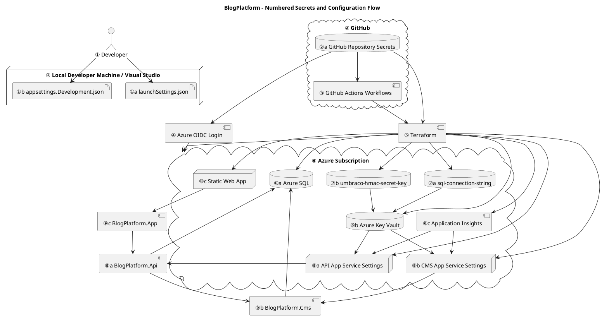

# Secrets and Configuration Guide

## Purpose

This document explains:

* Where secrets originate
* Where they are stored
* How they flow through the system
* How names map between GitHub, Terraform, Azure, Key Vault, App Services, and runtime applications
* Which component consumes each configuration value

This document should be read together with:

* README.md
* AZURE.md

---

# High-Level Overview

The system follows this flow:

1. Local development
2. GitHub repository secrets
3. GitHub Actions
4. Azure OIDC authentication
5. Terraform execution
6. Azure resources
7. Key Vault secrets
8. App Service settings
9. Runtime applications

---

# PlantUML Diagram



---

# Layer-by-Layer Explanation

## ① Local Development

### Role

Development Configuration

### Purpose

Allows developers to run the application locally.

### Typical Sources

* launchSettings.json
* appsettings.Development.json
* User Secrets
* Environment Variables

### Typical Values

| Name                                 | Purpose                        |
| ------------------------------------ | ------------------------------ |
| ASPNETCORE_ENVIRONMENT               | Select Development environment |
| ConnectionStrings__umbracoDbDSN      | Local database                 |
| Umbraco__CMS__Imaging__HMACSecretKey | Development HMAC key           |

---

## ② GitHub Repository Secrets

### Role

Secret Source

### Purpose

Stores encrypted deployment secrets used by CI/CD.

### Secrets

| Secret Name                   | Meaning                           |
| ----------------------------- | --------------------------------- |
| AZURE_CLIENT_ID               | Azure application identity        |
| AZURE_TENANT_ID               | Azure tenant                      |
| AZURE_SUBSCRIPTION_ID         | Azure subscription                |
| TF_STATE_RESOURCE_GROUP_NAME  | Terraform backend resource group  |
| TF_STATE_STORAGE_ACCOUNT_NAME | Terraform backend storage account |
| TF_STATE_CONTAINER_NAME       | Terraform backend blob container  |
| TF_STATE_KEY                  | Terraform state file name         |
| TF_VAR_SQL_ADMIN_LOGIN        | SQL administrator login           |
| TF_VAR_SQL_ADMIN_PASSWORD     | SQL administrator password        |

---

## ③ GitHub Actions

### Role

CI/CD Execution

### Purpose

Executes deployment workflows.

### Consumes

| Secret     | Purpose              |
| ---------- | -------------------- |
| AZURE_*    | Azure authentication |
| TF_STATE_* | Terraform backend    |
| TF_VAR_*   | Terraform variables  |

---

## ④ Azure OIDC Authentication

### Role

Azure Authentication

### Purpose

Authenticates GitHub Actions to Azure.

### Consumes

| Secret                | Purpose              |
| --------------------- | -------------------- |
| AZURE_CLIENT_ID       | Application identity |
| AZURE_TENANT_ID       | Azure tenant         |
| AZURE_SUBSCRIPTION_ID | Azure subscription   |

### Produces

| Output             | Purpose                |
| ------------------ | ---------------------- |
| Azure Access Token | Temporary Azure access |

---

## ⑤ Terraform Execution

### Role

Infrastructure Provisioning

### Purpose

Creates and configures Azure resources.

### Inputs

| Variable           | Purpose                    |
| ------------------ | -------------------------- |
| sql_admin_login    | SQL administrator username |
| sql_admin_password | SQL administrator password |
| TF_STATE_*         | Terraform state backend    |

### Creates

| Resource             | Purpose             |
| -------------------- | ------------------- |
| Azure SQL            | Database            |
| Key Vault            | Secret storage      |
| App Services         | Application hosting |
| Application Insights | Monitoring          |

---

## ⑥ Azure Resources

### Role

Infrastructure

### Resources

| Resource             | Purpose          |
| -------------------- | ---------------- |
| Azure SQL Server     | SQL hosting      |
| Azure SQL Database   | Application data |
| Azure Key Vault      | Secret storage   |
| Application Insights | Monitoring       |
| API App Service      | Backend hosting  |
| CMS App Service      | CMS hosting      |
| Static Web App       | Frontend hosting |

---

## ⑦ Key Vault Secrets

### Role

Secret Storage

### Secrets

| Secret Name             | Purpose                    |
| ----------------------- | -------------------------- |
| sql-connection-string   | Database connection string |
| umbraco-hmac-secret-key | Umbraco image signing key  |

### Consumers

| Consumer        | Uses                |
| --------------- | ------------------- |
| API App Service | Database connection |
| CMS App Service | Database connection |
| CMS App Service | HMAC key            |

---

## ⑧ App Service Settings

### Role

Runtime Configuration

### API App Service

| Setting                               | Purpose             |
| ------------------------------------- | ------------------- |
| ConnectionStrings__umbracoDbDSN       | Database connection |
| ApplicationInsights__ConnectionString | Telemetry           |
| KeyVault__VaultUri                    | Key Vault access    |
| UmbracoDeliveryApi__BaseUrl           | CMS endpoint        |

### CMS App Service

| Setting                               | Purpose             |
| ------------------------------------- | ------------------- |
| ConnectionStrings__umbracoDbDSN       | Database connection |
| ApplicationInsights__ConnectionString | Telemetry           |
| KeyVault__VaultUri                    | Key Vault access    |
| Umbraco__CMS__Imaging__HMACSecretKey  | HMAC signing        |

### Static Web App

| Setting    | Purpose          |
| ---------- | ---------------- |
| ApiBaseUrl | Backend endpoint |

---

## ⑨ Runtime Applications

### Role

Secret Consumers

### BlogPlatform.Api

| Setting                         | Purpose       |
| ------------------------------- | ------------- |
| ConnectionStrings__umbracoDbDSN | SQL access    |
| KeyVault__VaultUri              | Secret access |
| UmbracoDeliveryApi__BaseUrl     | CMS access    |

### BlogPlatform.Cms

| Setting                              | Purpose       |
| ------------------------------------ | ------------- |
| ConnectionStrings__umbracoDbDSN      | SQL access    |
| Umbraco__CMS__Imaging__HMACSecretKey | Image signing |
| KeyVault__VaultUri                   | Secret access |

### BlogPlatform.App

| Setting    | Purpose           |
| ---------- | ----------------- |
| ApiBaseUrl | API communication |

---

# Secret Flow Matrix

| Secret                                | Starts Here    | Travels Through              | Ends Here            |
| ------------------------------------- | -------------- | ---------------------------- | -------------------- |
| AZURE_CLIENT_ID                       | GitHub Secrets | GitHub Actions → Azure Login | Azure                |
| AZURE_TENANT_ID                       | GitHub Secrets | GitHub Actions → Azure Login | Azure                |
| AZURE_SUBSCRIPTION_ID                 | GitHub Secrets | GitHub Actions → Azure Login | Azure                |
| TF_VAR_SQL_ADMIN_LOGIN                | GitHub Secrets | GitHub Actions → Terraform   | Azure SQL            |
| TF_VAR_SQL_ADMIN_PASSWORD             | GitHub Secrets | GitHub Actions → Terraform   | Azure SQL            |
| sql-connection-string                 | Terraform      | Key Vault                    | API/CMS Runtime      |
| umbraco-hmac-secret-key               | Terraform      | Key Vault                    | CMS Runtime          |
| ApplicationInsights__ConnectionString | Azure          | App Service Settings         | Runtime Applications |

---

# Quick Mental Model

Think of the system as:

```text
GitHub Secrets
        ↓
GitHub Actions
        ↓
Azure Login (OIDC)
        ↓
Terraform
        ↓
Azure Resources
        ↓
Key Vault
        ↓
App Service Settings
        ↓
Running .NET Applications
```

If a secret is missing, start troubleshooting from the top and move downward through the flow.
